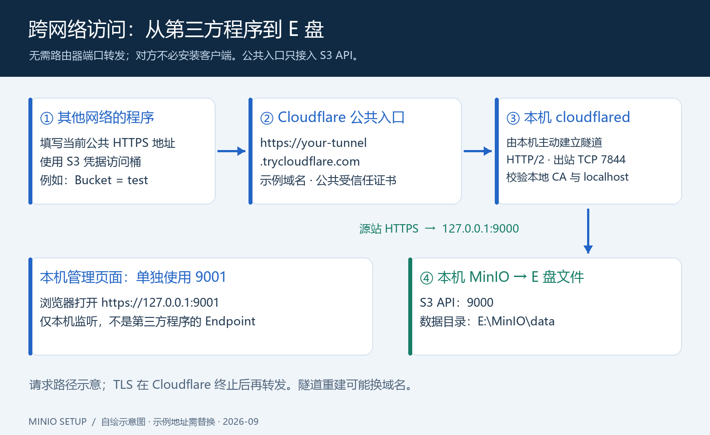

# Windows MinIO：E 盘部署、HTTPS 与跨网络访问

把 Windows 电脑上的文件存储变成可通过 S3 接口访问的服务。本仓库整理了 **2026-09-15 至 2026-09-17 的实际部署过程**，并提供可以逐步手动操作的中文图文教程。



**已经完成的部署：** MinIO 从源码构建并运行在 `E:\MinIO`；文件、日志、工具和构建缓存主要放在 E 盘；使用 MinIO 原生 HTTPS；通过 Cloudflare Quick Tunnel 给不在同一内网的程序提供临时公共 HTTPS 地址。无需管理路由器，也无需在对方服务器上安装客户端。

## 从这里开始

| 想做什么 | 打开哪份文档 |
| --- | --- |
| 从零一步一步部署，包含完整命令和图片 | **[手动部署图文教程](docs/manual-guide.md)** |
| 回顾本次做了什么、为什么这么做 | [实际部署记录](docs/deployment-log.md) |
| 填写 Bucket、Endpoint、AccessKeyId、SecretAccessKey | [四个值的填写模板](examples/connection.md) |
| 排查证书、网络、签名、隧道和上传问题 | [故障排查](docs/troubleshooting.md) |
| 查看测试证据、图片检查与验证边界 | [检查记录](docs/verification.md) |

## 最容易填错的三个地方

1. `9000` 是 S3 接口；`9001` 是本机管理页面。第三方存储程序填 **9000 对应的地址或它的公共隧道地址**。
2. 内网直连的自建 CA 证书，需要客户端信任；公共隧道使用 Cloudflare 的公共证书，通常不需要让对方安装你的 CA。
3. Quick Tunnel 是临时方案，重新建立隧道可能更换域名。`your-tunnel.trycloudflare.com` 只是示例，必须替换成当前输出的实际地址。

## 版本与范围

| 项目 | 本次实际使用 |
| --- | --- |
| 系统 | Windows 11 x64，PowerShell，安装目录 `E:\MinIO` |
| MinIO | `RELEASE.2025-10-15T17-29-55Z` |
| 源码提交 | `9e49d5e7a648f00e26f2246f4dc28e6b07f8c84a` |
| 编译工具链 | Go `1.24.8`；当时用于引导下载的便携 Go 为 `1.27.1` |
| cloudflared | `2026.9.1`，Windows amd64 |
| 本机 HTTPS | 私有 CA + MinIO 原生 TLS |
| 公共 HTTPS | Cloudflare Quick Tunnel，临时域名 |
| 自启动 | MinIO 在当前 Windows 用户登录时启动；隧道手动启动 |

这是一份已验证环境的复现记录，不把固定历史版本称为“最新版”。截至整理时，[MinIO 社区仓库](https://github.com/minio/minio)已于 2026-04-25 归档，社区发行方式为源码；新部署或长期承载重要业务前，应自行评估维护和升级方案。[Quick Tunnel 官方说明](https://developers.cloudflare.com/cloudflare-one/networks/connectors/cloudflare-tunnel/do-more-with-tunnels/trycloudflare/)将它定位于开发测试，没有 SLA，也不提供固定域名承诺。

## 仓库里有什么

```text
docs/                 手动教程、过程记录、排错与验收
  assets/             真实登录页截图 + 自绘中文示意图
examples/             第三方程序参数填写模板
scripts/
  Set-Credentials.ps1 当前 Windows 用户加密保存凭据
  generate-certificates.py 生成私有 CA 和服务端证书
  runtime/            复制到 E:\MinIO 的启停、状态和隧道脚本
tools/                图片生成源文件与文档检查工具
tests/                证书、原生 HTTPS、S3 与重启持久化的隔离验证
```

仓库中的内网 IP、账号与隧道域名均为示例；真实密码、私钥、存储数据、可执行文件、运行日志和在线隧道地址不随仓库发布。图片中的结构图明确标注为示意图，登录页图片来自实际运行的 MinIO。

本仓库没有打包 MinIO 或 cloudflared 二进制。MinIO 的 [AGPL-3.0 许可](https://github.com/minio/minio/blob/master/LICENSE)和 cloudflared 的 [Apache-2.0 许可](https://github.com/cloudflare/cloudflared/blob/master/LICENSE)分别适用于各自上游项目。
