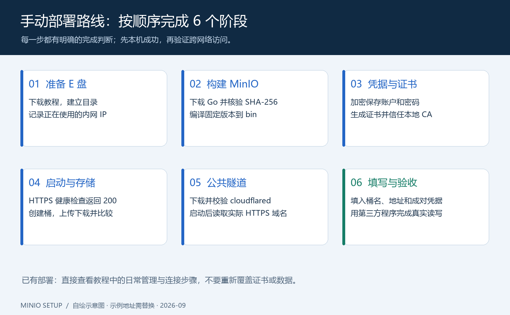
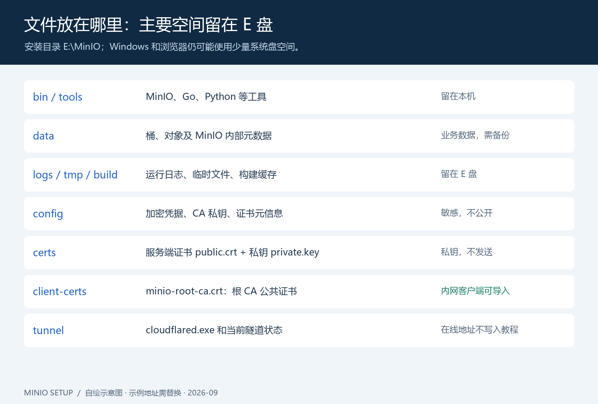
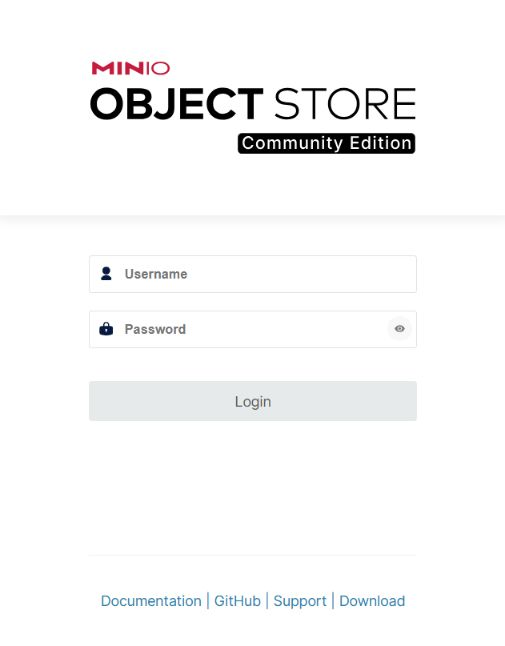
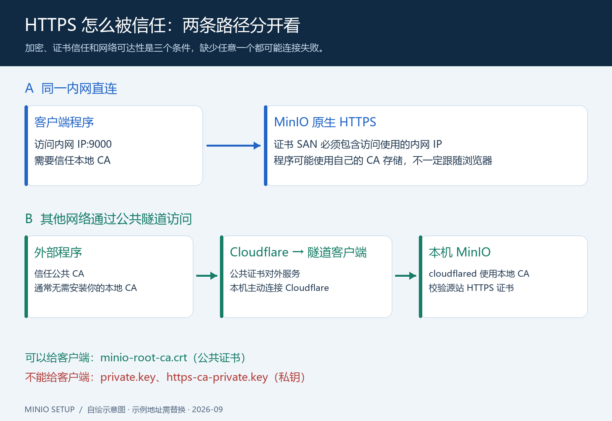
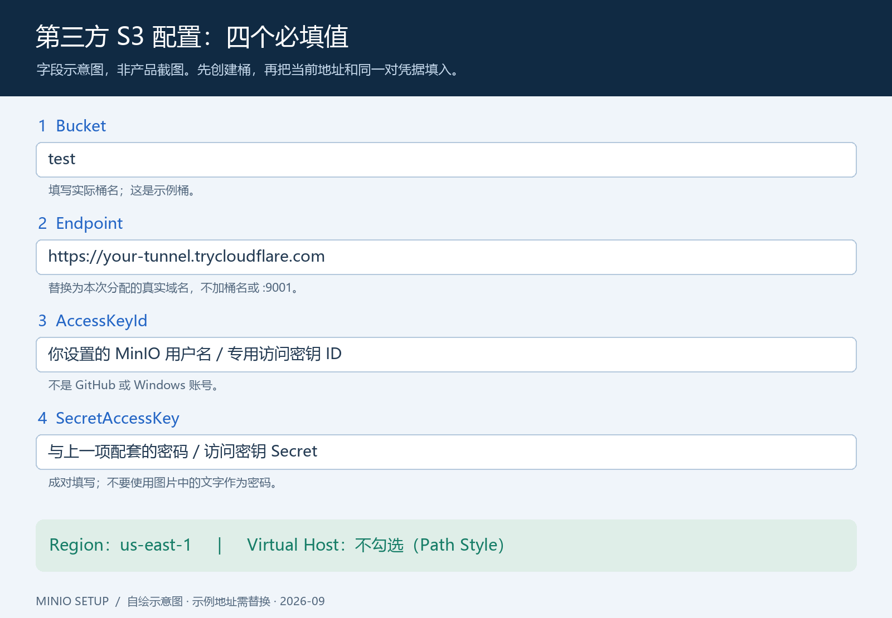

# Windows MinIO 手动部署图文教程

目标：将 MinIO 和主要运行文件放在 **E 盘**，启用 **HTTPS**，再让其他网络的服务器通过公共 HTTPS 地址连接。操作环境为 Windows x64 + PowerShell。本教程按本次已经验证的版本复现，适合个人测试和理解部署过程。

**如果你已经完成本次部署，不要在现有 `E:\MinIO` 上重新执行初始化、覆盖证书或覆盖运行脚本。** 日常启停看第 8 节，第三方接入看第 11 节。从零部署使用一个空目录；已有数据应先备份。

本文示例内网 IP 为 `192.168.1.50`，示例桶为 `test`。请替换为自己的信息。所有 PowerShell 命令按顺序在同一个窗口执行；新开窗口后需要重新定义 `$Root`、`$Repo` 等变量。不要在 CMD 窗口中粘贴 PowerShell 命令。



## 1. 下载本教程，准备 E 盘目录

在本仓库首页点 **Code → Download ZIP**，解压到 `E:\Projects\minio-setup`，确保这个目录下面能直接看到 `README.md` 和 `scripts`。也可在已安装 Git 时执行：

```powershell
git clone https://github.com/zhangzhuang9675/minio-setup.git E:\Projects\minio-setup
```

打开 PowerShell，检查磁盘、架构和 IP：

```powershell
Get-PSDrive -PSProvider FileSystem
[Environment]::Is64BitOperatingSystem
Get-NetIPConfiguration
```

确保 E 盘存在且有足够空间。工具、源码和构建缓存会用掉数 GiB，建议先准备至少 8 GiB 空闲空间，业务数据另算。记下正在使用的网卡的 IPv4 地址，不要误选虚拟机或未连接网卡。

下面创建**全新**安装目录；已有目录时会停止，避免把教程覆盖到正在运行的部署上：

```powershell
$Root = 'E:\MinIO'
$Repo = 'E:\Projects\minio-setup'
if (Test-Path -LiteralPath $Root) { throw '目录已存在；请先确认是否是已有部署，不要覆盖。' }
$folders = @('bin','data','logs','config','certs','certs\CAs','client-certs','tmp','downloads','build','tools','tunnel')
foreach ($folder in $folders) {
    New-Item -ItemType Directory -Path (Join-Path $Root $folder) -Force | Out-Null
}
$env:TEMP = "$Root\tmp"
$env:TMP = "$Root\tmp"
$env:PIP_CACHE_DIR = "$Root\build\pip-cache"
Set-ExecutionPolicy -Scope Process Bypass -Force
```

`-Scope Process` 仅影响当前窗口。教程把主要文件和缓存放在 E 盘，但浏览器、Windows 证书库和系统工具可能仍使用 C 盘。



## 2. 下载 Go，核验摘要并编译 MinIO

本次使用 Go 1.24.8 编译固定 MinIO 源码。原部署先下载便携 Go 1.27.1，再由 Go 自动选择 1.24.8 工具链；从零复现可以直接下载 1.24.8，少一次工具链下载。

从 [Go 官方下载列表](https://go.dev/dl/)获取 ZIP；下面命令从官方 JSON 列表取文件名和 SHA-256：

```powershell
[Net.ServicePointManager]::SecurityProtocol = [Net.SecurityProtocolType]::Tls12
$releases = Invoke-RestMethod 'https://go.dev/dl/?mode=json&include=all'
$release = $releases | Where-Object { $_.version -eq 'go1.24.8' }
$archive = $release.files | Where-Object { $_.os -eq 'windows' -and $_.arch -eq 'amd64' -and $_.kind -eq 'archive' }
if (@($archive).Count -ne 1) { throw '未找到对应的官方 Go 压缩包。' }
$zip = Join-Path "$Root\downloads" $archive.filename
Invoke-WebRequest -UseBasicParsing ("https://go.dev/dl/" + $archive.filename) -OutFile $zip
if ((Get-FileHash -LiteralPath $zip -Algorithm SHA256).Hash -ne $archive.sha256) { throw 'Go SHA-256 校验失败。' }
Expand-Archive -LiteralPath $zip -DestinationPath "$Root\tools"
& "$Root\tools\go\bin\go.exe" version
```

应看到 `go1.24.8 windows/amd64`。然后复制附带的运行脚本与构建脚本：

```powershell
Copy-Item -Path "$Repo\scripts\runtime\*" -Destination $Root -Recurse
& "$Root\build\Build-MinIO.ps1"
```

构建脚本的关键操作如下，可打开脚本逐行查看；它把所有 Go 缓存和输出目录定位到 E 盘：

```powershell
$env:GOTMPDIR = "$Root\tmp"
$env:GOPATH = "$Root\build\gopath"
$env:GOMODCACHE = "$Root\build\modcache"
$env:GOCACHE = "$Root\build\gocache"
$env:GOBIN = "$Root\bin"
$env:GOENV = 'off'
$env:GOTOOLCHAIN = 'go1.24.8'
$env:GOPROXY = 'https://goproxy.cn'
$env:CGO_ENABLED = '0'
```

该代理是第三方 Go 模块镜像；本次网络条件下使用它完成下载，未关闭 Go 模块校验。网络能直连时，也可在构建脚本中将 `GOPROXY` 改为 `https://proxy.golang.org,direct`。固定安装目标为：

```text
github.com/minio/minio@v0.0.0-20251015172955-9e49d5e7a648
```

**成功判断：** 出现 `E:\MinIO\bin\minio.exe`，脚本最后显示版本 `RELEASE.2025-10-15T17-29-55Z`。第一次构建需要下载很多依赖，请等进程结束；失败后查看具体错误再重试，不要把一个还在构建的窗口当成失败。

## 3. 设置 MinIO 用户名和密码

运行交互脚本，按提示输入用户名、密码和确认密码。密码输入时不会显示：

```powershell
& "$Repo\scripts\Set-Credentials.ps1" -Root $Root
```

用户名至少 3 个字符，密码至少 8 个字符，建议用随机长密码。脚本通过 Windows DPAPI 加密保存到 `config\credentials.xml`，并限制配置目录权限。启动 MinIO 和保存凭据应使用**同一个 Windows 用户**。

这里设置的是 MinIO 管理员凭据，不是 GitHub 账号，也不是 Windows 登录密码。首次测试时，这对凭据可以分别用于 `AccessKeyId` 和 `SecretAccessKey`。长期对接时再创建仅授权目标桶的专用凭据。

## 4. 准备 Python，生成 HTTPS 证书

如果已安装 Python，使用现有解释器；本次机器路径是 `E:\python\python.exe`。没有 Python 时，可从 [Python 官方 Windows 下载页](https://www.python.org/downloads/windows/)获取支持的 x64 安装包，在自定义安装中选择 E 盘。不要勾选会把整套 Python 安装到默认 C 盘路径的选项。

下面把教程所需依赖放在 E 盘虚拟环境中。按实际路径修改 `$BasePython`：

```powershell
$BasePython = 'E:\python\python.exe'
& $BasePython -m venv "$Root\tools\python-env"
if ($LASTEXITCODE -ne 0) { throw '创建 Python 虚拟环境失败。' }
$Python = "$Root\tools\python-env\Scripts\python.exe"
& $Python -m pip install --cache-dir "$Root\build\pip-cache" 'cryptography==48.0.0'
if ($LASTEXITCODE -ne 0) { throw '安装证书依赖失败。' }
```

限制证书目录权限，然后生成证书。**将 IP 改成第 1 步查到的实际内网 IP**：

```powershell
$sid = [System.Security.Principal.WindowsIdentity]::GetCurrent().User.Value
& icacls.exe "$Root\certs" /inheritance:r /grant:r "${sid}:(OI)(CI)F" '*S-1-5-18:(OI)(CI)F' '*S-1-5-32-544:(OI)(CI)F'
if ($LASTEXITCODE -ne 0) { throw '限制证书目录权限失败。' }
& $Python "$Repo\scripts\generate-certificates.py" --root $Root --lan-ip '192.168.1.50'
if ($LASTEXITCODE -ne 0) { throw '证书生成失败。' }
```

只需要本机和公共隧道时，可以省略 `--lan-ip`；脚本始终包含 `localhost`、设备名称、`127.0.0.1` 与 `::1`。多个内网地址可重复传入 `--lan-ip`。脚本拒绝覆盖已有证书，避免误换 CA 导致已配客户端失去信任。

| 文件 | 用途 | 是否给客户端 |
| --- | --- | --- |
| `certs\public.crt` | MinIO 服务端证书 | 通常不用单独发 |
| `certs\private.key` | MinIO 服务端私钥 | **不要发送** |
| `config\https-ca-private.key` | 根 CA 私钥 | **不要发送** |
| `client-certs\minio-root-ca.crt` | 根 CA 公共证书 | 内网直连需要时可以发送 |
| `config\https-certificate-info.json` | SAN、到期时间与证书摘要 | 本机查看 |

服务端证书有效期约 1 年，CA 约 10 年。查看元信息记录到期时间；内网 IP 改变时，需要按新 SAN 重新签发服务端证书。本仓库提供首次生成器，不提供自动续期器，详见[证书故障排查](troubleshooting.md)。

## 5. 让本机信任 CA，启动 HTTPS

仅导入公共 CA 证书到**当前用户**受信任根证书存储；看到 Windows 确认框时核对是刚生成的 MinIO CA：

```powershell
Import-Certificate -FilePath "$Root\client-certs\minio-root-ca.crt" -CertStoreLocation Cert:\CurrentUser\Root
& "$Root\Start-MinIO.ps1"
& "$Root\Status-MinIO.ps1"
```

**成功判断：** live、ready 和管理页面检查均显示 `HTTP 200 (certificate verified)`。

启动脚本实际执行的核心命令相当于下面这样，但会额外导入加密凭据、隐藏运行窗口、写日志和检查健康状态：

```text
minio.exe server E:\MinIO\data --address 0.0.0.0:9000 --console-address 127.0.0.1:9001 --certs-dir E:\MinIO\certs
```

不要直接运行这条简写来替代启动脚本，否则还需要自行设置账户环境变量。`0.0.0.0` 是监听地址，不能作为浏览器访问地址。

使用浏览器打开 **https://127.0.0.1:9001**，输入第 3 步设置的用户名和密码：



*真实截图：本机 MinIO Console 未登录状态。不同版本的外观可能不同；这张图片没有填写任何凭据。*

## 6. 创建桶，并做一次手动上传下载

1. 登录本机管理页面，进入桶列表；找到创建桶入口（可能显示 `Create Bucket`、`Create a Bucket` 或“创建存储桶”）。
2. 输入 `test`，保留默认私有访问，确认创建。若已经存在这个桶，直接打开。
3. 在电脑上准备一个普通文本文件，例如 `hello-minio.txt`，写入一行可辨认的文字。
4. 在桶页面选择上传，选中这个文件，确认它出现在对象列表。
5. 从页面下载该对象，打开检查文字一致；也可以对原文件和下载文件分别执行 `Get-FileHash -Algorithm SHA256` 比较摘要。

UI 文字会随版本改变；本次版本的控制台功能较精简。如果没有建桶入口，使用下面的官方 Python SDK 辅助示例完成创建，然后刷新管理页继续上传下载。已有桶会被保留；示例不会修改访问策略或将桶公开：

```powershell
& $Python -m pip install --cache-dir "$Root\build\pip-cache" 'minio==7.2.20'
if ($LASTEXITCODE -ne 0) { throw '安装 MinIO SDK 失败。' }
& $Python "$Repo\examples\create_bucket.py" --ca "$Root\client-certs\minio-root-ca.crt" --bucket test
if ($LASTEXITCODE -ne 0) { throw '创建或检查桶失败。' }
```

按提示输入第 3 步的用户名和密码，密码不会显示。成功后输出 `Bucket is ready: test`。此示例使用 HTTPS 并校验本地 CA；对应操作为官方 SDK 的 [bucket_exists / make_bucket](https://github.com/minio/minio-py)。后面的 `test` 只是示例，必须填你实际创建的桶名。不要把 Windows 文件夹名直接当成桶名。

## 7. 同一内网连接：信任 CA，按需放行端口



内网程序填写 `https://192.168.1.50:9000`，替换为真实内网 IP。客户端必须能连接该 IP，且验证所用 IP 必须在证书 SAN 中。

如果对方也是 Windows，先把 `client-certs\minio-root-ca.crt` 复制到对方电脑，在实际运行客户端的用户环境下导入受信任根证书。Linux、Java、容器或 SDK 可能有独立 CA 存储，需要按该程序的配置指定 CA；仅给浏览器导入证书不等于所有程序都信任。

需要允许局域网其他设备访问，且本机防火墙拦截了端口时，才在**管理员 PowerShell** 中执行下面规则。网络类别应是你信任的 Private 网络，不要随便把公共网络改成 Private：

```powershell
New-NetFirewallRule -DisplayName 'MinIO S3 LAN 9000' -Direction Inbound -Action Allow -Protocol TCP -LocalPort 9000 -RemoteAddress LocalSubnet -Profile Private
```

控制台 `9001` 仍只在本机开放。不需要为了 MinIO 关闭防火墙。若只用本机访问和后面的出站隧道，不需要这条入站规则。

**HTTPS 本身不解决跨网络路由。** `192.168.x.x`、`10.x.x.x` 等内网地址，不能直接填到其他网络的服务器上期待连通。

## 8. 修改账户密码、重启与登录自启动

修改用户名和密码：重新运行凭据脚本，再停启 MinIO。脚本会保留上一份加密凭据备份；备份依然属于敏感配置，不要上传 GitHub。

```powershell
& "$Repo\scripts\Set-Credentials.ps1" -Root $Root
& "$Root\Stop-MinIO.ps1"
& "$Root\Start-MinIO.ps1"
& "$Root\Status-MinIO.ps1"
```

第三方程序若使用管理员账户，需要同步更新两项凭据。修改账号密码不会主动删除桶和数据；不要删除 `data` 目录来“重置账号”。

日常也可双击安装目录中的 `Start-MinIO.cmd`、`Stop-MinIO.cmd` 和 `Status-MinIO.cmd`。这些包装脚本会保留窗口方便看结果。

可选：以当前用户登录为触发条件创建计划任务：

```powershell
$user = [System.Security.Principal.WindowsIdentity]::GetCurrent().Name
$arguments = '-NoProfile -ExecutionPolicy Bypass -File "' + (Join-Path $Root 'Start-MinIO.ps1') + '"'
$action = New-ScheduledTaskAction -Execute 'powershell.exe' -Argument $arguments -WorkingDirectory $Root
$trigger = New-ScheduledTaskTrigger -AtLogOn -User $user
$principal = New-ScheduledTaskPrincipal -UserId $user -LogonType Interactive -RunLevel Limited
$settings = New-ScheduledTaskSettingsSet -StartWhenAvailable -AllowStartIfOnBatteries -DontStopIfGoingOnBatteries
Register-ScheduledTask -TaskName 'MinIO-Local-E' -Action $action -Trigger $trigger -Principal $principal -Settings $settings
```

这不是开机未登录即可运行的系统服务。若同名任务已存在，先检查原任务，不要用 `-Force` 盲目覆盖。电脑睡眠、关机或断网会影响外部可用性。

## 9. 下载 cloudflared 并核验文件

没有路由器管理权限，也不能接触对方服务器时，让本机主动连出到 Cloudflare。先确认 MinIO 已通过第 5 步检查，然后下载本次验证版本：

```powershell
$download = 'https://github.com/cloudflare/cloudflared/releases/download/2026.9.1/cloudflared-windows-amd64.exe'
$cloudflared = "$Root\tunnel\cloudflared.exe"
Invoke-WebRequest -UseBasicParsing $download -OutFile $cloudflared
$expected = '2837888cc0f5d58f15b6dc478376de90b4d3ba5241c7947455d1e0a0df429712'
if ((Get-FileHash -LiteralPath $cloudflared -Algorithm SHA256).Hash -ne $expected) { throw 'cloudflared 校验失败，请勿运行。' }
& $cloudflared --version
```

应显示 `2026.9.1`。摘要对应这一特定版本和架构，升级时必须同时换成对应官方摘要。[官方 release](https://github.com/cloudflare/cloudflared/releases/tag/2026.9.1)提供来源核对。

下载失败可从官方 release 页面手动下载，再移动到上面的 E 盘路径并重新校验；可以先设置浏览器下载目录为 E 盘。不要把下载中断留下的不完整 EXE 当成完整文件使用。

## 10. 手动建立公共 HTTPS 隧道

最直观的方式是新开 PowerShell 窗口运行下面命令，让窗口保持打开：

```powershell
E:\MinIO\tunnel\cloudflared.exe tunnel --no-autoupdate --protocol http2 --edge-ip-version 4 --url https://127.0.0.1:9000 --origin-server-name localhost --origin-ca-pool E:\MinIO\client-certs\minio-root-ca.crt
```

日志会给出形如 `https://your-tunnel.trycloudflare.com` 的地址。这里的 `your-tunnel` 是占位符，你得到的实际单词组合不同。看到已分配域名之后，还要等待连接建立并做健康检查；仅分配域名不等于源站已连通。

这一命令不要求路由器端口转发；外部程序不需要安装 cloudflared。当前采用 HTTP/2 传输，需要本机能访问 Cloudflare 的相关出站网络，通常是 TCP 7844。

如果希望后台运行，先在前台隧道窗口按 **Ctrl+C** 停止它，然后在原窗口执行仓库提供的包装脚本：

```powershell
& "$Root\Start-Public-Tunnel.ps1"
& "$Root\Show-Public-Endpoint.ps1"
```

不要同时使用前台和后台方式，以免自己混淆不同隧道地址。后台脚本的当前地址保存在 `E:\MinIO\tunnel\current-tunnel.json`，日志在 `logs`。双击 `Show-Public-Endpoint.cmd` 可以再次查看地址和健康状态。

检查公共地址，把下面示例换成刚分配的真实地址：

```powershell
$Endpoint = 'https://your-tunnel.trycloudflare.com'
curl.exe --noproxy '*' --silent --show-error --output NUL --write-out '%{http_code}' --connect-timeout 8 --max-time 20 "$Endpoint/minio/health/ready"
```

**成功判断：** 输出 `200`。这里不使用 `--insecure`，也不需要向外部客户端发送你的本地 CA。Cloudflare 对外使用公共证书；隧道客户端使用 `--origin-ca-pool` 校验本机 MinIO 的私有证书。

不要把目标端口改成 `9001`，也不要额外设置 `--http-host-header localhost`。S3 签名包含 Host，随意改写可能造成 `SignatureDoesNotMatch`。

停止后台隧道：

```powershell
& "$Root\Stop-Public-Tunnel.ps1"
```

停止隧道不会停止 MinIO。Quick Tunnel 没有固定域名和 SLA 承诺、限制 200 个同时进行的请求且不支持 SSE。代理还会影响请求大小与超时；大文件必须按实际分片大小测试，不要仅凭小文件成功就认定无限制。此方案适合验证，长期稳定服务可再迁移到固定域名的命名隧道或其他受控入口。

## 11. 第三方程序里的四个值怎么填



*示意图按需求中的字段绘制，不冒充某个程序的截图；域名、用户名称和密码提示均为占位说明。*

| 字段 | 跨网络时填写 | 从哪里获得 |
| --- | --- | --- |
| **Bucket** | `test`，或你的实际桶名 | 第 6 步创建的桶 |
| **Endpoint** | 当前真实 `https://……trycloudflare.com` 地址 | 第 10 步日志或 `Show-Public-Endpoint.cmd` |
| **AccessKeyId** | 你的 MinIO 用户名，或专用访问密钥 ID | 第 3 步设置值，或之后创建的专用凭据 |
| **SecretAccessKey** | 与上一项配套的密码或访问密钥 Secret | 同一对凭据，不能混用 |

可选项：Region 填 **`us-east-1`**，Virtual Host **不勾选**，即 Path Style。Endpoint 不加 `/test`、不加 `/minio`、不带 `:9001`。若输入框自动加 `https://`，只填域名即可；以程序实际输入规则为准。

如果对方程序就在这台电脑，Endpoint 改成 `https://127.0.0.1:9000`；同一内网则用 `https://你的内网IP:9000` 并解决 CA 信任。所有场景的桶名和凭据含义不变，详见[填写模板](../examples/connection.md)。

点击第三方页面的 **测试连通性**。成功后再通过那个程序做一次小文件上传、下载和内容比较。这个动作很重要：健康接口 200 只能证明入口存活，不能证明账号权限、S3 签名和应用的协议配置全部正确。

## 12. 完成后的检查清单

- [ ] 程序在 E 盘，数据实际写入 `E:\MinIO\data`，日志和缓存也在 E 盘。
- [ ] `Status-MinIO.ps1` 全部通过，本机管理页可以登录。
- [ ] 手动上传下载的小文件内容一致，重启 MinIO 后仍能下载。
- [ ] 本地 HTTPS 按正确 CA 和 SAN 校验；没有通过关闭证书验证掩盖问题。
- [ ] 公共隧道健康接口 200，使用的是当前运行的隧道地址。
- [ ] 第三方应用使用正确桶、Endpoint 和成对凭据，并实际完成读写。
- [ ] 没有发布账户密码、私钥或桶内数据；记录了证书到期时间。
- [ ] 明白睡眠、关机、断网和隧道地址变化都会影响连接。

遇到问题时，按[故障排查](troubleshooting.md)从本机 HTTPS → 隧道 → 第三方程序逐层检查。本次实际完成的验证范围见[检查记录](verification.md)，不要把待做的第三方验收当成已经通过。

## 参考来源

- [MinIO 官方源码仓库](https://github.com/minio/minio)与[本次固定发行版本](https://github.com/minio/minio/releases/tag/RELEASE.2025-10-15T17-29-55Z)
- [MinIO TLS 配置说明](https://github.com/minio/minio/blob/master/docs/tls/README.md)
- [Go 官方下载](https://go.dev/dl/)
- [cloudflared 官方发行](https://github.com/cloudflare/cloudflared/releases)
- [Cloudflare Quick Tunnel 用法和限制](https://developers.cloudflare.com/cloudflare-one/networks/connectors/cloudflare-tunnel/do-more-with-tunnels/trycloudflare/)
- [Cloudflare HTTP 413 与上传限制说明](https://developers.cloudflare.com/support/troubleshooting/http-status-codes/4xx-client-error/error-413/)
